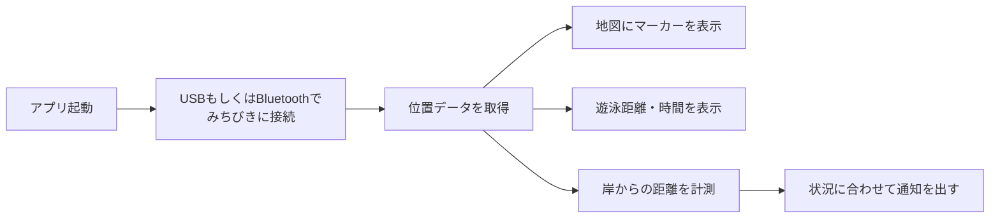

# Biwa Swim

琵琶湖でのアクティビティやトラッキングを想定した、GNSS/GPS連携リアルタイム位置追跡 Android アプリケーションです。

---

## 📌 プロジェクト概要

**Biwa Swim** は、みちびきから受信した位置情報（NMEAデータ）を解析し、国土地理院の高解像度航空写真マップ上にリアルタイムで現在地を表示・追跡するAndroidアプリです。

現在は、USBシリアル経由でGNSSデバイスを接続し、受信した位置情報を地図上にリアルタイム表示するところまで実装しています。

---

## ✨ 主な機能

- **🗺️ リアルタイムマッピング (MapLibre)**
  - MapLibre Native SDK を活用した滑らかな地図描画
  - 国土地理院（GSI）のシームレス空中写真タイルを採用
  - 琵琶湖を中心とした鳥瞰（チルト）3Dカメラビュー
  - リアルタイムなマーカー追従表示

- **🔌 みちびきとのシリアル通信 (USB)**
  - FTDI等のUSB-UART変換チップ（USBシリアル通信）に対応
  - USB機器の自動検出・接続およびパーミッション処理
  - 受信バッファからのストリームデータ解析

- **🛰️ NMEAセンテンスのリアルタイム解析**
  - `$GNGLL`（地理位置情報センテンス）の抽出・解析
  - DMS（度分秒）形式から十進角（Decimal Degrees）形式への座標変換

- **📶 接続ステータス表示**
  - デバイスの接続状態（Connected / Disconnected）を画面上にリアルタイム表示

---

## 🚀 今後の開発予定 (Roadmap)

- **💧 水分補給アラート**
  - 定期的な水分補給を促す通知機能を追加予定
- **📏 移動距離・時間の計測**
  - 走行/遊泳中の移動距離と経過時間を表示する機能を追加予定
- **🗺️ 移動ルートの軌跡表示**
  - 移動ルートを地図上に線で描画し、あとから振り返れるようにする予定


---

## 🛠️ 技術スタック

| カテゴリ | 技術 / ライブラリ |
| :--- | :--- |
| **言語** | Kotlin |
| **プラットフォーム** | Android (minSdk: 26 / targetSdk: 37) |
| **ビルドツール** | Android Gradle Plugin 9.3.1, Version Catalog (libs.versions.toml) |
| **地図描画** | [MapLibre Native Android SDK](https://maplibre.org/) v13.5.0 (ラスタタイル: 国土地理院 シームレス写真) |
| **USBシリアル通信** | [usb-serial-for-android](https://github.com/mik3y/usb-serial-for-android) v3.7.0 |
| **Bluetooth通信** | Android Bluetooth API（SPP プロファイル） |
| **ジオメトリ演算** | [JTS Topology Suite](https://locationtech.github.io/jts/) v1.20.0 (jts-core / jts-io-common) |
| **UI** | ConstraintLayout v2.2.2, Material Design v1.14.0 |
| **Kotlin 拡張** | androidx.core-ktx v1.19.0, androidx.activity-ktx v1.13.0 |

---

## 📂 プロジェクト構成

```
biwaswim/
├── app/
│   ├── src/main/
│   │   ├── java/com/rencon/biwaswim/
│   │   │   ├── MainActivity.kt               # エントリポイント・画面制御
│   │   │   ├── bluetooth/
│   │   │   │   ├── BluetoothGpsManager.kt    # Bluetooth GNSS デバイス管理
│   │   │   │   ├── BluetoothGpsListener.kt   # 接続イベントコールバック定義
│   │   │   │   └── SppSession.kt             # SPP セッション制御
│   │   │   ├── map/
│   │   │   │   └── MapManager.kt             # MapLibre 地図描画・マーカー管理
│   │   │   ├── nmea/
│   │   │   │   ├── NmeaParser.kt             # NMEA センテンス解析
│   │   │   │   ├── NmeaLineBuffer.kt         # 受信バッファリング
│   │   │   │   ├── GpsLocation.kt            # 位置情報データクラス
│   │   │   │   └── CalculateDistance.kt      # 移動距離計算
│   │   │   ├── notification/
│   │   │   │   └── sendNofication.kt         # 通知送信ユーティリティ
│   │   │   ├── permission/
│   │   │   │   └── checkPermission.kt        # 実行時パーミッション処理
│   │   │   ├── service/
│   │   │   │   └── GpsConnectionService.kt   # GPS 接続フォアグラウンドサービス
│   │   │   └── usb/
│   │   │       ├── UsbSerialManager.kt       # USB シリアルデバイス管理
│   │   │       └── UsbSerialListener.kt      # USB 接続イベントコールバック定義
│   │   ├── res/
│   │   │   ├── layout/activity_main.xml      # メイン画面レイアウト
│   │   │   ├── values/                       # 文字列・色・スタイルリソース
│   │   │   ├── values-ja/                    # 日本語ローカライズリソース
│   │   │   ├── values-night/                 # ダークモード用カラーリソース
│   │   │   └── xml/device_filter.xml         # 対応 USB デバイス設定
│   │   └── AndroidManifest.xml              # 権限・USB / Bluetooth Intent フィルタ設定
│   └── build.gradle.kts                     # アプリ依存関係・ビルド設定
├── gradle/
│   └── libs.versions.toml                   # バージョンカタログ（依存関係の一元管理）
├── build.gradle.kts
├── settings.gradle.kts
└── README.md
```

---

## ⚙️ 動作要件・セットアップ

1. **Android端末**: USB Host（OTG）機能および（将来的に）Bluetooth機能を備えた端末 (Android 7.0 / API 24 以上)
2. **GNSSデバイス**: NMEAデータ（`$GNGLL`等）を出力するUSBシリアル対応GNSS/GPSレシーバー
3. **ビルド環境**: Android Studio Ladybug 以降 / JDK 11
